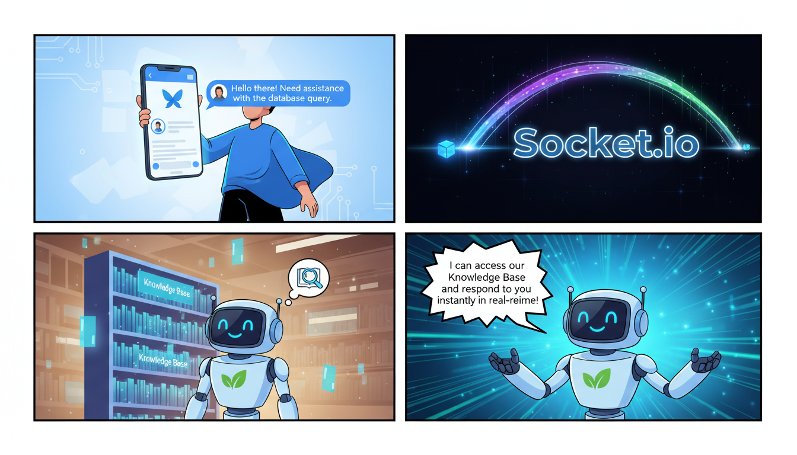

This is a comprehensive README.md tailored for the **botpress-socketio-app**, based on the provided file structure (indicating a Flutter/Dart project) and the existing description for the "ProcessAI Client Suite."

***

# Botpress Socket.io Client (ProcessAI Client Suite)

[](https://flutter.dev)
[](https://botpress.com)
[](https://socket.io)

## 📖 Overview

The **Botpress Socket.io Client** is a high-performance Flutter application designed to act as a bridge between end-users and the **Botpress** conversational engine. Part of the **ProcessAI Client Suite**, this application provides a centralized interface for managing knowledge bases, bot behaviors, and real-time conversation tracking.

By leveraging **Socket.io**, the app ensures low-latency, bi-directional communication, allowing for a seamless and responsive chat experience that surpasses standard webhook-based integrations.

## ✨ Key Features

-   **Real-Time Messaging**: Instant bi-directional communication using Socket.io.
-   **Botpress Integration**: Native-like experience for Botpress-powered bots.
-   **Knowledge Base Management**: Centralized access to documentation and AI-driven responses.
-   **Conversation Tracking**: Detailed history and state management of user interactions.
-   **Cross-Platform**: Built with Flutter, supporting Android, iOS, and Web.
-   **ProcessAI Optimized**: Specifically configured for the ProcessAI ecosystem for advanced bot behavior control.

## 🏗️ Architecture

The application follows a standard Client-Server architecture:
1.  **Frontend**: Flutter (Dart) Mobile/Web App.
2.  **Middleware**: A Socket.io server (usually Node.js) that translates Socket events to Botpress API calls.
3.  **Engine**: Botpress Cloud/Self-hosted instance handling the NLU and dialogue logic.

## 🚀 Getting Started

### Prerequisites

-   [Flutter SDK](https://docs.flutter.dev/get-started/install) (latest stable version).
-   A running [Botpress](https://botpress.com/) instance.
-   A Socket.io relay server (configured to communicate with the Botpress API).

### Installation

1.  **Clone the repository**:
    ```bash
    git clone https://github.com/your-repo/botpress-socketio-app.git
    cd botpress-socketio-app
    ```

2.  **Install dependencies**:
    ```bash
    flutter pub get
    ```

3.  **Configure Environment**:
    Create a `.env` file in the root directory (or update your config file) with your server details:
    ```env
    SOCKET_URL=https://your-socket-server.com
    BOT_ID=your-bot-id
    ```

4.  **Run the application**:
    ```bash
    flutter run
    ```

## 💻 Usage Examples

### Initializing Socket Connection

The application uses the `socket_io_client` package to maintain a persistent connection.

```dart
import 'package:socket_io_client/socket_io_client.dart' as IO;

void connectToServer() {
  IO.Socket socket = IO.io('https://your-socket-server.com', <String, dynamic>{
    'transports': ['websocket'],
    'autoConnect': false,
  });

  socket.connect();

  socket.onConnect((_) {
    print('Connected to ProcessAI Bridge');
    socket.emit('join_conversation', {'botId': 'my_bot_123'});
  });

  socket.on('message_received', (data) {
    print('Bot says: ${data['text']}');
  });
}
```

### Sending a Message to Botpress

```dart
void sendMessage(String text) {
  final payload = {
    'message': text,
    'timestamp': DateTime.now().toIso8601String(),
    'userId': 'user_001',
  };
  
  socket.emit('user_message', payload);
}
```

## 🛠️ Project Structure

-   `lib/`: Contains the core logic and Flutter UI components.
-   `.dart_tool/`: (Internal) Flutter build and device management tools.
-   `assets/`: Icons, images, and local configuration files.

> **Note**: Several files in the `.dart_tool/chrome-device` directory are generated by the Flutter environment during web debugging. These should generally be ignored in version control (`.gitignore`).

## 🤝 Contributing

We welcome contributions to the ProcessAI Client Suite! 

1.  Fork the Project.
2.  Create your Feature Branch (`git checkout -b feature/AmazingFeature`).
3.  Commit your Changes (`git commit -m 'Add some AmazingFeature'`).
4.  Push to the Branch (`git push origin feature/AmazingFeature`).
5.  Open a Pull Request.

## 📄 License

This project is licensed under the MIT License - see the [LICENSE](LICENSE) file for details.

---
**Developed by the ProcessAI Team**  
*Optimizing bot operations through centralized knowledge and real-time intelligence.*